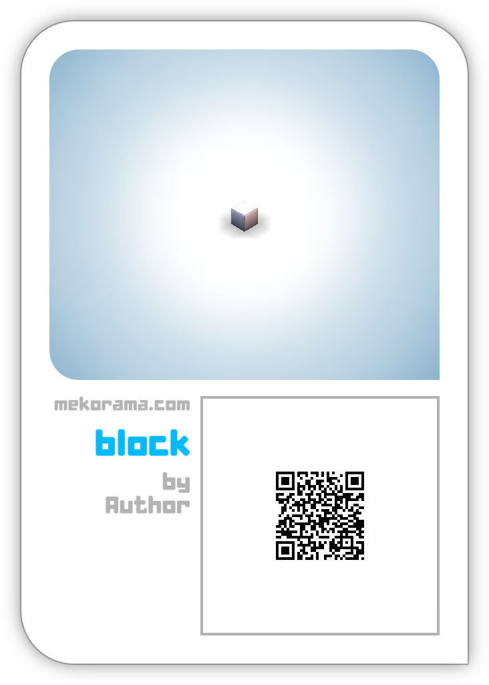
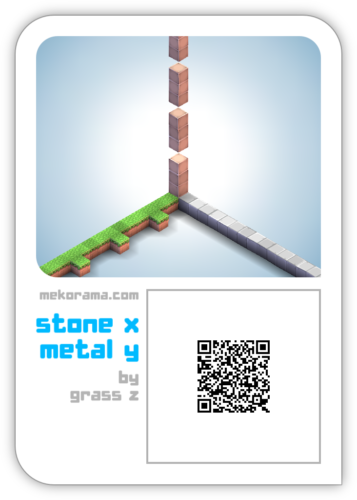

# MekoQR

Read and write [Mekorama](http://www.mekorama.com/) level QR codes.

Ultimately, the goal of this project is to provide methods for the reading, manipulating, and generating Mekorama levels.

For discussion, see http://mekoramaforum.com/threads/qr-code-format.257/. Thanks to @Gepeto for help with reverse engineering.

# Level Format

The level generates QR codes with a light error correction. The for the above level, the encoded binary data looks something like this:

> 01 13 0D FC **78 01** ED CA B1 09 C0 20 00 00 B0 76 68 FF F2 15 5D 04 05 41 F4 7F 6F
> 70 14 93 39 5F AC 2D 95 3F CC 91 5B 7F 00 00 B8 D3 BB B5 01 38 DC 02 C7 33 04 8B

The first four bytes are constant and seem to be a header for Mekorama levels. The bytes starting with `78 01` are the actual level data, compressed with the DEFLATE algorithm (used by gzip, zip, zlib, etc).

This decompresses to 

> **05** 62 6C 6F 63 6B **06** 41 75 74 68 6F 72 00 00 00 00 ... 01 00 ... 00

This is the length and ascii codes for the title ("block") and author ("Author"), followed by the level data. Most blocks in the 16 x 16 x 16 level are encoded by one byte of data, but blocks with different orientations get two bytes. This level contains a single block, so it has a single 0x01 byte and 4095 zeros.

The blocks are given in x, y, z order. Relative to the thumbnail, the x axis goes towards the front right, y goes upward, and z goes towards the front left.

# License

Code by Spencer Bliven. Copyright 2016.

Licensed under GPL 3.0.
